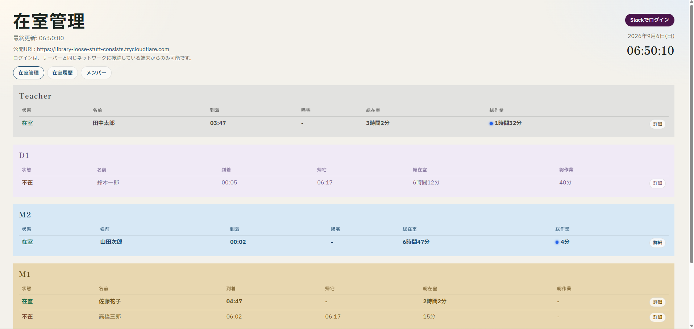
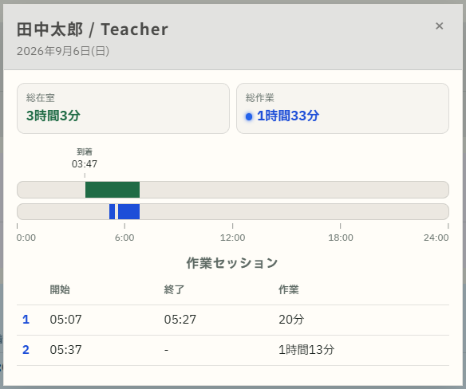
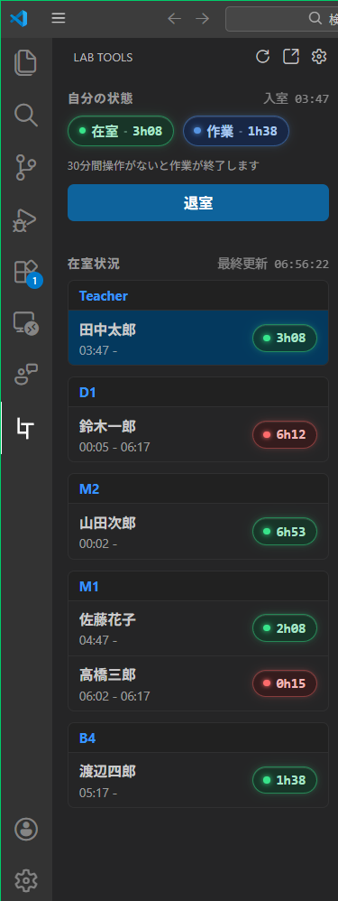
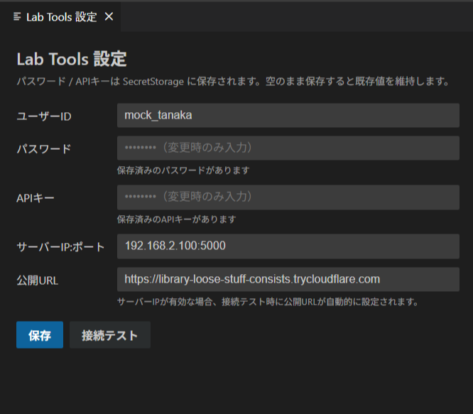
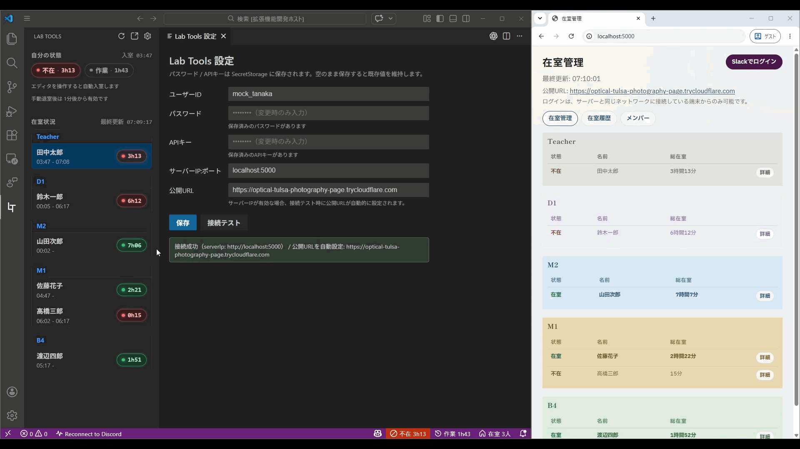

# lab-management

研究室の **在室管理** と **作業記録** を行うシステムです。

ブラウザ、VS Code / Cursor 拡張、スマートフォンから、同じサーバー上の API に接続します。

| 役割 | この README の節 |
|------|------------------|
| 全体のイメージを知りたい | [概要](#概要) |
| サーバーを立てる・メンテする | [サーバー管理者向け](#サーバー管理者向け) |
| 在室を使うだけ | [ユーザー向け](#ユーザー向け) |

---

## 概要

研究室メンバーの **いま誰がいるか** と **作業中かどうか** を、同じサーバー上の API で共有するシステムです。  
ブラウザ（Web）、VS Code / Cursor 拡張（Lab Tools）、スマートフォンのショートカットから同じ在室・作業データにアクセスします。

認証は **Sign in with Slack**（Web）と、拡張／ショートカット向けの **共有 APIキー + メンバー資格情報** を併用します。データは **PostgreSQL** に保存し、既定ではポート **`5000`** で待ち受けます。学外からは **Cloudflare Quick Tunnel**（`*.trycloudflare.com`）経由で公開できます。

### 主な機能

| 機能 | 内容 | 主な入口 |
|------|------|----------|
| **在室** | 入室・退室、今日の在室一覧、詳細ダイアログ | Web / 拡張 / スマホショートカット |
| **作業** | 在室中の作業開始・終了（拡張では編集操作に連動可） | Web / 拡張 |
| **メンバー** | Slack ログイン後の自己登録、一覧・編集、管理者／一般 | Web |
| **履歴** | 日別の在室・作業の確認 | Web |

### 画面のイメージ

#### 1. 今日の研究室（Web）

<p align="center">
  
</p>

<p align="center">
  
</p>

#### 2. エディタから使う（Lab Tools）

<p align="center">
  
  &nbsp;&nbsp;&nbsp;
  
</p>

<p align="center">
  
</p>

### 想定環境

研究室マシンにサーバーを置き、同じ LAN（またはトンネル経由）のメンバーが使う運用を想定しています。

| 区分 | 想定 |
|------|------|
| **サーバー OS** | **Windows 10 / 11**（付属スクリプトは PowerShell 5.1+） |
| **ランタイム** | **Python 3**（`venv` / `.venv` 推奨）＋ `requirements.txt` |
| **DB** | **PostgreSQL**（既定ポート `5432`。`DATABASE_URL` で接続） |
| **認証・通知** | Slack アプリ（Sign in with Slack + Bot Token） |
| **エディタ拡張** | **VS Code** または **Cursor**（`engines.vscode` ^1.80.0） |
| **スマホ入退室** | **iPhone** ショートカット＋Wi‑Fi オートメーション（Android は各自アプリで同等を構築） |

### 構成

```text
lab-management/
  server/                 … FastAPI（API・認証・DB アクセス）
  client/                 … Web UI（在室・メンバー・履歴）
  vscode-extension/       … Lab Tools（VS Code / Cursor 拡張）
  scripts/                … 起動・停止・DB 初期化（PowerShell）
  docs/                   … セットアップ手順書
  tools/                  … cloudflared 等の手元配置先（任意）
  .env.example            … 環境変数のひな形
```

- 起動例: `.\scripts\server-start.ps1`
- 停止例: `.\scripts\server-stop.ps1`

### 利用者ごとの入り口

| 利用者 | 使うもの | 詳細ドキュメント |
|--------|----------|------------------|
| 全員（Web） | ブラウザでサーバー URL を開く | Slack ログインは管理者が用意したアプリを利用 |
| エディタ利用者 | Lab Tools 拡張 | [vscode-extension/lab-tools/README.md](./vscode-extension/lab-tools/README.md) |
| スマホ利用者 | ショートカット＋Wi‑Fi オートメーション | [docs/attendance-shortcuts-setup.md](./docs/attendance-shortcuts-setup.md) |
| サーバー管理者 | DB・Slack・トンネル・拡張の配布 | 下の [サーバー管理者向け](#サーバー管理者向け) |

---

## サーバー管理者向け

研究室マシンにサーバーを置き、メンバーへ接続先・APIキー・拡張（VSIX）を配布する人向けです。

### 推奨セットアップ順

1. **PostgreSQL** を入れ、`.env` の `DATABASE_URL` を設定する  
   → [docs/postgresql-setup.md](./docs/postgresql-setup.md)
2. **Slack アプリ**（Sign in with Slack + Bot）を作り、`.env` に Client ID / Secret / Bot Token 等を書く  
   → [docs/slack-app-setup.md](./docs/slack-app-setup.md)
3. `.env.example` を `.env` にコピーし、`API_KEY`・`ADMIN_SLACK_USER_ID`・`SESSION_SECRET` なども埋める
4. **DB 初期化**（`.\scripts\db-init.ps1`）でテーブルと初期管理者を投入する  
   → 詳細は postgresql / slack の docs
5. **学外アクセスを設定**
   → [docs/cloudflared-setup.md](./docs/cloudflared-setup.md)
6. **サーバー起動**（`.\scripts\server-start.ps1`）
7. **VS Code 拡張をビルド／VSIX 化**してメンバーに渡す  
   → [docs/vscode-extension-setup.md](./docs/vscode-extension-setup.md)
8. メンバーに次を案内する  
   - Web の URL（LAN の `http://サーバーIP:5000` や公開 URL）  
   - 共有 **APIキー**（拡張・ショートカット用）
   - 必要なら VSIX と [入退室ショートカット手順](./docs/attendance-shortcuts-setup.md)

### よく使うスクリプト

| スクリプト | 用途 |
|------------|------|
| `scripts/db-init.ps1` | DB・テーブル・初期データ |
| `scripts/db-reset.ps1` | DB を作り直す（破壊的） |
| `scripts/db-status.ps1` | 接続確認 |
| `scripts/server-start.ps1` | アプリ（＋任意で tunnel）起動 |
| `scripts/server-stop.ps1` | 停止 |

### 管理者用ドキュメント一覧

| ドキュメント | 内容 |
|--------------|------|
| [docs/postgresql-setup.md](./docs/postgresql-setup.md) | PostgreSQL 導入・`DATABASE_URL`・init |
| [docs/slack-app-setup.md](./docs/slack-app-setup.md) | Slack アプリ・Redirect・Bot・`.env` |
| [docs/cloudflared-setup.md](./docs/cloudflared-setup.md) | Quick Tunnel・公開 URL |
| [docs/vscode-extension-setup.md](./docs/vscode-extension-setup.md) | 拡張のビルド・VSIX 配布（`vsce` の警告で `y` など） |

---

## ユーザー向け

サーバーが既に動いている前提です。接続先・APIキー・アカウントは **管理者から受け取ってください**。

### Web（ブラウザ）

1. 管理者から案内された URL を開く（例: `http://192.168.x.x:5000`）
2. **Sign in with Slack** でログインする
3. 初回は自己登録の流れに従い、以降は在室一覧・メンバー・履歴を利用する

ログインできない場合は、管理者に Slack アプリ／Redirect URL／自分のメンバー登録を確認してもらってください。

### VS Code / Cursor 拡張（Lab Tools）

在室一覧・入退室・作業記録をエディタから使います。

→ **利用者向け手順**: [vscode-extension/lab-tools/README.md](./vscode-extension/lab-tools/README.md)

### iPhone ショートカット（Wi‑Fi 連動の入退室）

研究室 Wi‑Fi への接続／切断で在室・退室を自動化します。

→ [docs/attendance-shortcuts-setup.md](./docs/attendance-shortcuts-setup.md)

Android は同ドキュメント内の短い案内どおり、上記を参考に各自で設定してください。

### ユーザーが参照するドキュメント

| ドキュメント | 内容 |
|--------------|------|
| [vscode-extension/lab-tools/README.md](./vscode-extension/lab-tools/README.md) | 拡張のインストール・接続設定・使い方 |
| [docs/attendance-shortcuts-setup.md](./docs/attendance-shortcuts-setup.md) | iPhone 在室／退室ショートカット |

---

## ライセンス・公開範囲

Marketplace への拡張公開や、名前付き Cloudflare Tunnel の利用は想定していません。研究室内部での運用を前提としています。
